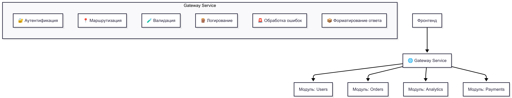

# 🧩 Модульный Backend через Центральный Gateway

Централизованный backend-сервис, в котором все входящие запросы с фронтенда проходят через одну точку — **Gateway-сервис**. Он занимается маршрутизацией, валидацией, логированием, авторизацией и обработкой ответа. Бизнес-логика разбита на независимые модули, к которым обращается только Gateway.

---

## 📐 Архитектура

Архитектура предпологает следующий вариант взаимодействия с системой:



То есть суть следующая.

1. Фронтенд посылает в точку входа запрос с параметрами.
2. Исходя из всех этих параметров эта точка входа фильтрует, сериализует их и создает экземпляр вызываемого метода.
3. Передает все параметры в метод класса и запускает выполнение. 
4. Если есть ошибка, то точка входа должна залогировать и вернуть ответ

## Формат ответа

Формат ответа методов никак не должен изменятся. Форматом ответа занимается точка входа, которая вызывает метод. 

Возвращаемый резульат всегда должен быть единого формата.

### Пример ожидаемого ответа при успешном выполненении

```
{
    result: <Возвращаемое методов информация. Сюда так же может пойти мета информация>,
    total: ?int - Если есть возможность посчитать колиечство возвращаемых значений
    nexOffset: ?int - если был указан в методе лимит и есть что еще запросить
    limit: ?int - сколько было запрошено
    offset: ?int - какое колиечство от начала было запрошено
}
```

### Пример ожидаемого ответа при ошибке выполненения

```
{
    errors: any[] - Массив объектов ошибок, которая содержит код ошибки и текст ошибка
}
```
